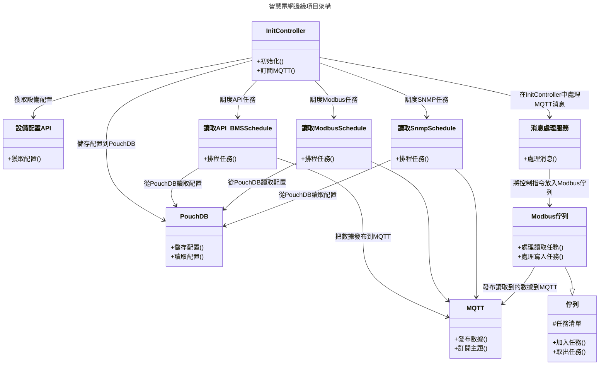

```
npm install
npm run format
npm run dev
```

```
open http://localhost:3000

GET http://localhost:3000/api/modbus
```

# 智慧電網邊緣項目 (Smart Grid Edge Project)

## 項目簡介

本項目旨在實現一個智慧電網邊緣設備管理系統，透過各種通信協議（如 API、SNMP、Modbus）從設備中讀取數據並進行處理，最終將數據傳送到服務器。該系統包括排程任務、設備配置管理、數據存儲及消息處理等功能。

## 架構圖

以下是系統的架構圖，幫助您更好地理解項目結構：



## 專案詳細說明

### Controllers

- `initController.ts`: 負責初始化系統及訂閱 MQTT 主題。在此控制器中，會通過 `API/devicesConfigAPI.ts` 從服務器獲取設備配置信息，並將其儲存到 PouchDB 中。根據傳入的頻率信息，設置不同的任務排程。

### API

- `API/devicesConfigAPI.ts`: 與服務器通信以獲取設備的配置信息。

### Storage

- `PouchDB`: 用於本地存儲設備配置數據。

### Schedulers

- `schedulers/readAPIBMSScheduler.ts`: 調度 API 排程的執行。從 PouchDB 讀取配置後，根據配置頻率排程任務。
- `schedulers/readModbusScheduler.ts`: 調度 Modbus 排程的執行。從 PouchDB 讀取配置後，根據配置頻率排程任務。
- `schedulers/readSnmpScheduler.ts`: 調度 SNMP 排程的執行。從 PouchDB 讀取配置後，根據配置頻率排程任務。

### MQTT

- 通過 MQTT 發布讀取到的數據到特定主題，並訂閱相關控制指令主題。

### Services

- `services/messageHandlerServices.ts`: 處理通過 MQTT 接收到的消息。專門處理訂閱主題中的 `control/modbus` 指令，並將指令經過隊列進行處理。

### Queue

- `queue/modbusQueue.ts`: 用於處理 Modbus 的 `read` 和 `write` 任務，實現任務的加入和取出操作。
